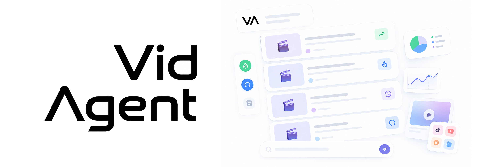

# VidAgent - 自然语言驱动的多平台视频分析Omni方案

VidAgent 是一个基于 Omni 原生全模态模型的视频总结分析 Agent，在自然语言交互下，能够完成意图理解、跨平台检索、视频下载、多模态总结的全链路工作，并将结果以优雅的卡片流向用户呈现。项目现阶段由基于vLLM-Omni框架的Qwen3-Omni模型高效驱动，未来将面向丰富的Omni模型生态，为更多的全模态模型接口提供支持。

<br>

<div align="center">
  
</div>

<br>

* 真正的原生 Omni 视频理解：基于 Qwen3-Omni 全模态模型，让 AI 直接“听原音、看画面”，精准捕捉语气情绪与视觉细节，实现最原生的视频内容剖析。
* 多平台数据大一统，无缝接入多平台：无论是关键词搜索、热榜追踪，还是指定创作者主页，所有平台的信息获取与分析都被统一在了一个对话框里。
* 自然语言驱动交互，用户友好的 UI 体验：VidAgent 提供媲美现代 AI 助手的 Next.js Web 界面，将复杂爬虫封装在用户友好的流畅的交互体验下。

---

## 快速开始

### 1. 启动服务

1.1 基础环境

请确保本机已正确配置 [Docker 环境](https://docs.docker.com/engine/install/)。对于Windows 用户，需先进行以下额外操作：

* 确保 Docker Desktop 版本 ≥ 4.34
* 打开 Docker Desktop → Settings → **Resources** → **Network**；
* 勾选 **Enable host networking**，点击 **Apply & restart**；
* 若此前开启过 **Enhanced Container Isolation**，需将其关闭，两者互斥。

1.2 克隆仓库

```bash
git clone https://github.com/LionelGuo/VidAgent.git && cd VidAgent
```

1.3 复制配置文件

```bash
cp .env.example .env
```

1.4 修改 .env 文件，配置好模型调用接口，详见下方[模型配置参数说明](#模型参数配置说明)


1.5 构建并启动 Docker 容器

```bash
docker build -t vidagent .
docker run --network=host --env-file .env vidagent
```

服务启动完成后，在浏览器中打开 [http://localhost:3000](http://localhost:3000) 即可开始体验完整的 Agent 链路。

### 2. 配置平台访问（按需选择）

VidAgent 支持多平台的数据采集与分析，你可以根据实际需求配置对应的平台授权：

* **B站 (Bilibili)**：需在 `.env` 中填入账号 Cookie，详见下方 [B站 Cookie 获取方法](#b站-cookie-获取方法)。
* **YouTube**：需在 `.env` 中配置对应的 API Key、Cookie 文件路径以及网络代理，详见下方 [YouTube 配置指引](#youtube-配置指引)。
* **抖音 / 小红书 / 快手**：依赖本地浏览器环境。需先 [打开 Chrome 的 Remote Debugging 模式](#chrome-打开-remote-debugging-的方法)，在弹出的安全提示中点击“允许”，并在新打开的浏览器界面中手动登录你自己的平台账号即可。

### 3. 本地部署模型（可选）

如果本机显存 ≥ 24GB，可以直接在本地私有化部署多模态模型 `Qwen3-Omni-Thinking` 的 4bit 量化版本以获得最佳体验。

项目已内置一键脚本，支持“零参数”串联执行，装完即刻启动：

```bash
# 1. 运行安装脚本下载并配置模型
# 默认下载至 <项目根目录>/models/（内部已锚定脚本位置，不随启动路径漂移）
# 若需自定义路径可执行：bash scripts/deploy_vllm_omni.sh [MODEL_DIR]
bash scripts/deploy_vllm_omni.sh

# 2. 安装完成后，直接启动推理服务（默认读取上述默认路径）
# 若前面自定义了路径，这里需对应执行：bash scripts/start_vllm_bare.sh [MODEL_PATH]
bash scripts/start_vllm_bare.sh
```

服务拉起后，只需将 `.env` 文件中的服务调用端点替换为本地部署的地址即可开始使用（详见下方 [模型配置参数说明](#模型配置参数说明)）。

---

## 详细配置指南

### 模型配置参数说明

在 `.env` 文件中，模型相关的配置主要有以下四项。目前系统支持 `vllm`（本地私有化部署）和 `siliconflow`（云端 API）等模式。切换 `LLM_PROVIDER` 时，请务必同步修改下方对应的三项参数：

```ini
# 模型提供方选项：vllm / siliconflow / generic
LLM_PROVIDER=siliconflow

# 模型服务密钥
# - siliconflow：填入你在平台申请的 API Key (例如 sk-xxx)
# - vllm：本地自托管模式下可随意填写任意字符串
LLM_API_KEY=sk-xxx

# 模型服务端点 (Base URL)
# - siliconflow：填写 https://api.siliconflow.cn/v1
# - vllm：填写本地部署的服务端点，例如 http://127.0.0.1:6006/v1
LLM_BASE_URL=https://api.siliconflow.cn/v1

# 模型名称
# - siliconflow：填写云端模型名称，如 Qwen/Qwen3-Omni-30B-A3B-Thinking
# - vllm：填写本地模型的绝对目录路径
LLM_MODEL=Qwen/Qwen3-Omni-30B-A3B-Thinking
```

### B站 Cookie 获取方法

1. **登录网页版**：在浏览器中打开 [Bilibili 官网](https://www.bilibili.com/) 并登录你的账号。
2. **打开开发者工具**：按下 `F12` 键（或右键点击页面选择“检查”），切换到 **“网络 (Network)”** 面板。
3. **刷新页面**：按下 `F5` 刷新当前网页，让浏览器重新发送请求。
4. **定位请求**：在网络面板的请求列表中，点击任意一个核心请求（通常是最顶部的 `www.bilibili.com` 或 `nav` 接口）。
5. **提取 Cookie**：在右侧的 **“请求头 (Request Headers)”** 区域找到 `Cookie` 字段，将其后方的**整段字符串**复制下来，粘贴到 `.env` 文件中的 `BILI_COOKIE` 字段。

### YouTube 配置指引

**1. 获取 YouTube API Key**

1. 访问 [Google Cloud Console](https://console.cloud.google.com/) 并登录 Google 账号。
2. 点击顶部导航栏创建或选择一个现有的**项目 (Project)**。
3. 在左侧菜单进入 **“API 和服务 (APIs & Services)”** -> **“库 (Library)”**。
4. 搜索 `YouTube Data API v3`，点击进入并选择 **“启用 (Enable)”**。
5. 返回 **“API 和服务”**，进入 **“凭据 (Credentials)”** 面板。
6. 点击顶部 **“创建凭据 (Create Credentials)”** -> **“API 密钥 (API Key)”**，复制生成的密钥并填入 `.env` 中的 `YOUTUBE_API_KEY`。

**2. 获取并配置 YouTube Cookie**

1. 在 Chrome 网上应用店安装 [Get cookies.txt LOCALLY](https://chromewebstore.google.com/detail/get-cookiestxt-locally/cclelndahbckbenkjhflpocjadpjhebc) 插件。
2. 打开 YouTube 网页并登录你的账号。
3. 点击浏览器右上角的该插件图标，选择 **“Export”** 将 Cookie 导出为 `.txt` 文本文件。
4. 将该文件存放在项目的安全目录中，并在 `.env` 中填入该文件的**绝对路径**（例如 `/path/to/youtube_cookies.txt`）。

### Chrome 打开 Remote Debugging 的方法

抖音、小红书、快手等平台的数据采集依赖本地浏览器的 CDP（Chrome DevTools Protocol）调试机制。请按以下步骤配置你的 Chrome：

1. **准备浏览器**：请确保已安装最新版 Chrome 浏览器（**版本需 ≥ 144**，[官方下载地址](https://www.google.com/chrome/)）。
2. **开启调试功能**：在 Chrome 的地址栏中输入 `chrome://inspect/#remote-debugging` 并回车。
3. **授权调试**：在页面中找到并勾选 `Allow remote debugging for this browser instance`（允许调试当前浏览器实例）选项。
4. **验证就绪**：当页面上显示 `Server running at: 127.0.0.1:9222` 时，说明远程调试端口已成功开启。此时在弹出的系统安全提示中点击“允许”，并在当前浏览器界面中直接打开抖音/小红书/快手网页手动登录账号即可。

---

## 项目结构

```
server/           FastAPI 后端（main.py 编排 + sse_relay.py 协议转换）
src/vidagent/
├── tools/
│   ├── crawler.py · downloader.py · summarizer.py   检索/下载/总结工具
│   └── platforms/   五平台适配（bilibili/youtube/douyin/xiaohongshu/kuaishou + CDP 共享层）
├── utils/        wbi.py · dates.py · storage.py · audio.py · frames.py · timer.py
├── llm_provider.py   provider 预设系统（relay/媒体格式/推理模式；端点/密钥/模型名由 .env 显式配置）
└── config.py     配置读取（.env → Pydantic Settings）
frontend/         Next.js 前端（chat 路由 + 组件 + stores）
vendor/MediaCrawler/   抖音/小红书/快手 CDP 平台依赖（vendored 源码，非商用许可，见 NOTICE）
scripts/          deploy_vllm_omni.sh（安装 vllm-omni + 模型）· start_vllm_bare.sh（启动服务）
```
